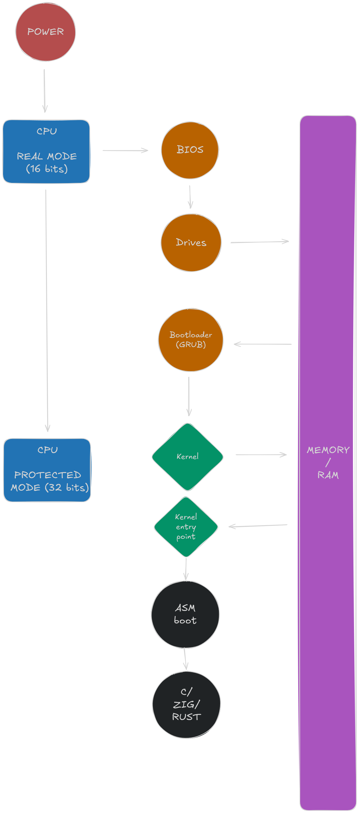

# kernel playground
Repo in which i experiment with different languages to help me choose a language for 42 Paris KFS projects. (and because i'm interested in all of these languages)

[C++](./docs/cpp.md) as a C-style kernel with restricted C++ subsets
 
[Zig](./docs/zig.md) the new C
 
[Rust](./docs/rust.md) because i like crabs


## Usage  

Simply cd into the language of your choice and run the makefile

```bash
git clone https://github.com/kuruae/kernel-playground.git kpg

cd kpg && cd rust

make
make run-iso  # needs some dependencies
```
 
## dependencies
**common:**
- make
- nasm

**C++:**
- Clang

**Rust:**
- rustup

**Zig**
- Zig (yes)

**For emulation (run-iso):**
- qemu
- xoriso (libisoburn)
- mtools

## Explanations
A normal userspace program usually looks like this:

BIOS -> bootloader -> os -> libc/runtime -> main()
but instead we're going to do baremetal/freestanding programming so you can remove the runtime, the os, and subtitute the bootloader by grub
so next time we get pointer arithmetic wrong the whole system crashes :)

### asm bootstrap
that's our entry point

it basically does this:
- define multiboot header for GRUB
- setup a stack
- call the kernel entry function
- halt forever if the kernel returns

### linker script
The linker is what decides:
- where sections go in memory
- where the entrypoint is
- how the final ELF is laid out

The linker script also defines where the kernel is loaded,
around 1MB for x86 kernels (2MB advised for 64bits)

Without the linker script the compiler would produce a normal userspace executable layout

### kernel source

This is where we write real code in our language of choice

Very simple goal to test our languages (as of when im writing this):
- access VGA text memory
- write characters manually into it

VGA has a native text mode mapped at 0xB8000, and it's made of 80x25 cells

Each cell is:
- 1 byte for ASCII character
- 1 byte for color

So we can print on the screen by directly interacting with the hardwares memory

## Misc

